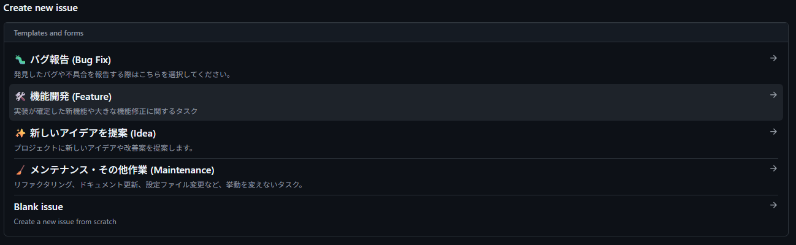

# 開発ガイドライン (CONTRIBUTING.md)

ここでは、リポジトリのクローンからmainブランチへのマージまでの一連の流れを説明します。
Windows版VScodeを使用した説明を行いますが、他のOSやエディタでも大体同じです。
開発環境の構築は既に済んでいるものとします（未構築の場合は[README.md](../README.md)の「開発環境 (Requirements)」を参照してください）。

## 1. 開発プロジェクトのクローン

### WSL上でETrobo環境を開く

環境構築をした際にダウンロードした`Start ETrobo SPIKE-RT.cmd`を実行する。

見つからない場合には、VScodeを起動し、左下の`リモートウィンドウを開く` -> `WSLへの接続` -> `フォルダを開く` をクリックし、etrobo環境を選択する。

### リポジトリをクローン

下記のコマンドを実行し、リポジトリをクローンしてください。

```
# workspaceフォルダに移動
cd workspace
# リポジトリをクローン
git clone https://github.com/cs-ando-lab/ETrobo2026.git
# クローンしたリポジトリに移動
cd ETrobo2026
# クローンしたフォルダをVScodeで開く
code .
```

#### Gitのコミット情報を設定する

コミット履歴として記録される名前とメールを登録します。
既に設定している場合もありますが、この情報は全世界に公開されてしまうため、プライバシー保護の観点から大学のメールアドレスなどを設定している場合にはGitHubが提供するダミーのメーアドレスに変更しておきましょう。

自分の専用アドレスを確認したい場合は、以下の手順で確認できます。

1. GitHubの右上アイコンから Settings を開く。

2. 左メニューの Emails を選択。

3. Keep my email addresses private にチェックを入れると、そのすぐ下に {id}+{username}@users.noreply.github.com という形式のアドレスが表示されます。

```
git config user.name <GitHubのユーザー名>
git config user.email <GitHub提供の非公開メールアドレス>
```

## 2. Issueを作成する

機能開発・修正を行う場合には、GitHub上でIssueを作成することを**推奨**します。
必須でないのは、ごく小さな機能・修正であっても作成することになると開発効率が下がるためです。

### Issue作成方法

1. GitHubのプロジェクトにアクセスし、上部のタブから`Issues`をクリックする。
   https://github.com/cs-ando-lab/ETrobo2026

2. `New Issue`をクリックし、選択画面から作成するIssueの種類を選択する。
   
3. 必要事項を記述し、`Create`をクリックする。

作成したIssueの番号は、後述のPR作成時に`closes #番号`として記載します。そうすることで、PRがマージされたタイミングでIssueも自動的にクローズされます。

## 3. コードの変更

### プル

開発を始める前には、**必ず**プルを行います。プルとは、リモートの変更をローカルに取り込む操作のことです。

VSCodeでソース管理画面を開くと、リモートが更新されている場合には「変更の同期」と表示されるためこれをクリックする。これは、VSCodeが自動でフェッチ(リモートの更新情報を取得すること)を行ってくれるためですが、まれに自動更新されないことがあるので、「変更の同期」と表示されない場合でも手動でフェッチを毎回行うことを推奨します。

### ブランチ作成

開発を始める前には、**必ず**ブランチを作成します。

1.  VScodeのフッター左に表示されている赤枠の場所をクリック(特になにもしていなければ`main`と表示されているはず)
    

2.  `新しいブランチを作成`をクリックし、作成するブランチ名を入力する。
    ブランチの命名は[Git / GitHub 運用フロー](GIT_WORKFLOW.md)を参考にしてください。

    

    ブランチが正常に作成されると左下の表記が作成したブランチ名になります。

    

### コードの変更

コードの変更やファイルの追加・削除を行います。

### ビルド・動作確認

コミットする前に、必ず手元でビルドが通ることを確認してください。ビルド・実機への転送方法は[README.md](../README.md)の「実行方法」を、走行体の内部状態の確認方法は[走行体とのBLE接続](BLE_CONNECT.md)を参照してください。

ビルドが通ることを確認せずにプッシュすると、後述のCIによるビルドチェックで初めてエラーに気づくことになり手戻りが大きくなるため、ここで必ず確認しましょう。可能であれば実機に転送して、実際の動作も確認します。ここで確認した内容は、後述のPR作成時に「テスト項目」として記入します。

### コミット

1. VScodeの左側タブの赤枠をクリックすると、そのブランチで変更したファイル一覧が表示されます。
   

2. コミットの前段階として、変更したファイルをステージングという状態にします。

   

3. 赤枠の部分にコミットメッセージを入力し、コミットボタンを押します。コミットルールは[Git / GitHub 運用フロー](GIT_WORKFLOW.md)を参考にしてください。

   

   **この説明では、一度にすべての変更をコミットしていますが、本来は機能ごとに分割してコミットすることが望ましいです。**

### プッシュ

コミットを行うと下記のように`Branchの発行`と表示されるのでこれをクリックします。
これによりローカルブランチをリモートにも反映します。


## 4. PRの作成・マージ

### PR作成

ブランチの発行後に https://github.com/cs-ando-lab/ETrobo2026 にアクセスすると下記のようにブランチがプッシュされた通知が来ます。この`Compare&pull request`をクリックします。


すると、このようにプルリクエストの作成画面が表示されます。関連Issueや変更内容を記述し、`Create pull request`をクリックします。


### CI

PRを作成すると、フォーマットチェックとビルドチェックが自動で開始されます。
フォーマットチェックは、失敗すると GitHub Actions によって自動修正されそのブランチにコミットされます。**この自動修正コミットが入った後にローカルで作業を続ける場合は、先に`git pull`してリモートの変更を取り込んでください。** これを忘れると、ローカルとリモートの内容がズレて次のプッシュ時にエラーになります。

チェックの詳細は[CI(継続的インテグレーション)](CI.md)を参照してください。

### PR作成後の修正

PR作成後で問題が見つかった場合には、VSCodeに戻りコードを変更し再びコミット&プッシュを行います。プッシュするたびにCIが再実行されます。

### mainブランチへのマージ

CIが成功し、コンフリクトが発生していない場合には、`Merge pull request` を押して作成したブランチをmainブランチに統合することができます。

マージ後は、`git pull`を実行しローカルの`main`ブランチを最新化しましょう。

これで作業は終了です。

## 参考資料

[VScodeだけでGit操作を完結させるのだ～～ッ!!](https://zenn.dev/praha/articles/db1c4bcc4ef48c)
